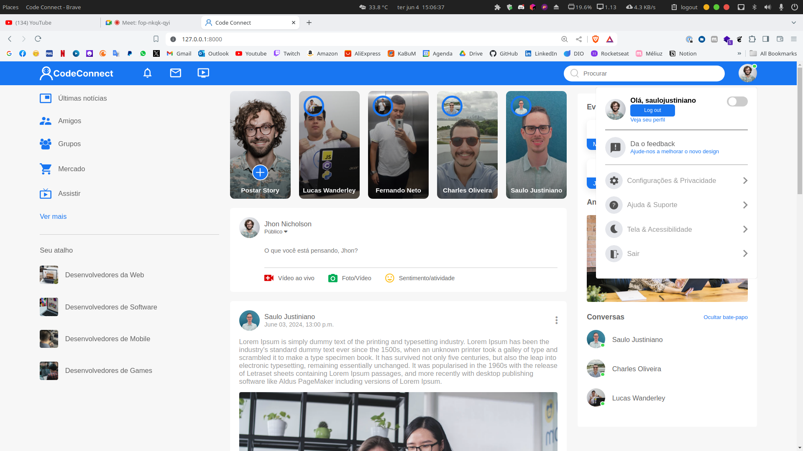

<h1 align="center">
  
  Code Connect
</h1>

<div align="center">
  
  
  
  
  

  <a href="https://github.com/saulojustiniano1/projeto-login/commits/master">
    
  </a>
  
  <a href="https://github.com/clasSeven7/code-connect/issues">
    
  </a>
</div>

<div align="center">
  
</div>

## 💻Projeto

**Code Connect** - é uma plataforma de rede social para todos os tipos de pessoas que desejam compartilhar conhecimento, experiências e projetos. A plataforma é voltada para desenvolvedores, designers, empreendedores e entusiastas de tecnologia.

## 📌Características

**Autenticação de Usuários:** O sistema permite o registro e autenticação de usuários.
**CRUD de Dados:** Os usuários autenticados podem criar, ler, atualizar e deletar dados.
**Paginação:** A interface do usuário é projetada para ser responsiva e fácil de usar em vários dispositivos.
**Filtros de Pesquisa:** Os usuários podem filtrar os produtos por categoria e preço.

## ⌨️Tecnologias Utilizadas

**Django:** Django é um framework de alto nível para Python que incentiva o desenvolvimento rápido e o design limpo e pragmático.
**Postgres:** Postgres é um sistema de gerenciamento de banco de dados SQL de objeto-relacional.

## 📋Pré-requisitos

- HTML5
- CSS3
- JavaScript
- Django

## 📚Bibliotecas utilizadas

- [Django](./docs/django.md)
- [Django-environ](./docs/django-environ.md)
- [Psychopg2](./docs/psychopg2.md)

## 🚀Tecnologias

- [VSCode](https://code.visualstudio.com)
- [Git](https://git-scm.com)

## 🔑Instalação

1. Clone o repositório:

```bash
git clone https://github.com/seu-usuario/nome-do-repositorio.git
```

2. Instale as dependências com `pip install -r requirements.txt`

3. Execute as migrações com `python manage.py migrate` para linux use `python3 manage.py migrate`

4. Inicie o servidor com `python manage.py runserver` para linux use `python3 manage.py runserver`

## 💡Commit

- 📦 `feat:` - _Funcionalidades novas_
- 📤 `fix:` - _Atualizações de códigos_
- 🐞 `bug:` - _Correções de Bugs_
- 🚩 `realese:` - _Versões do projeto_
